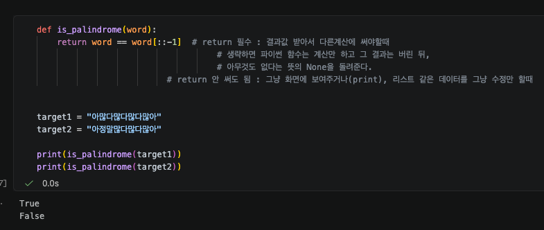
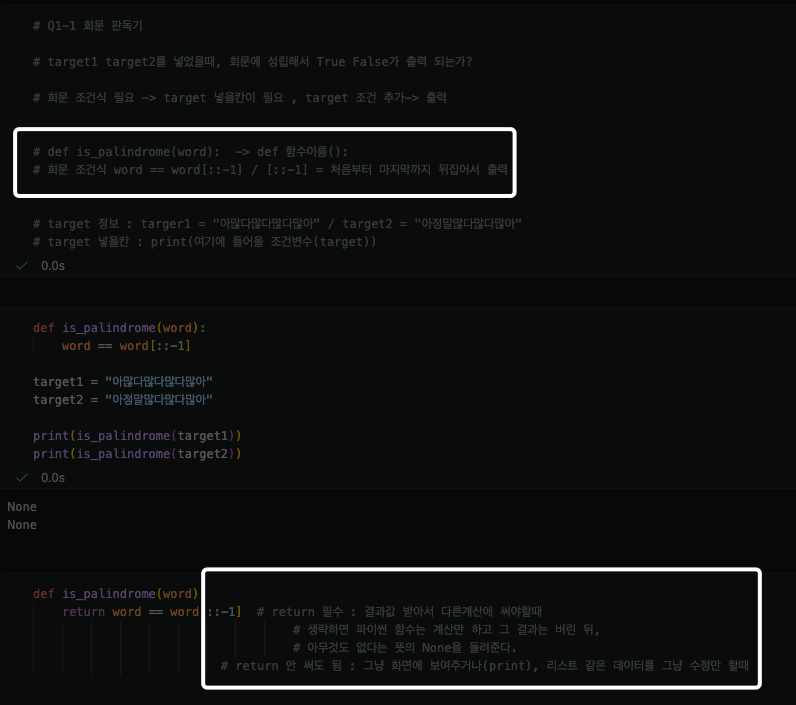
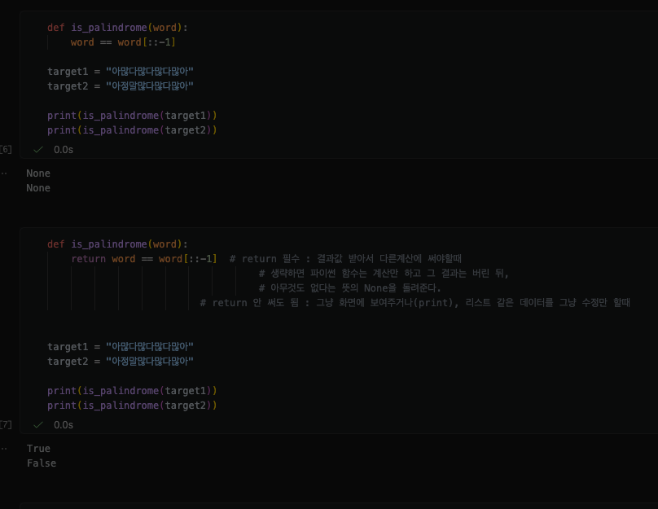
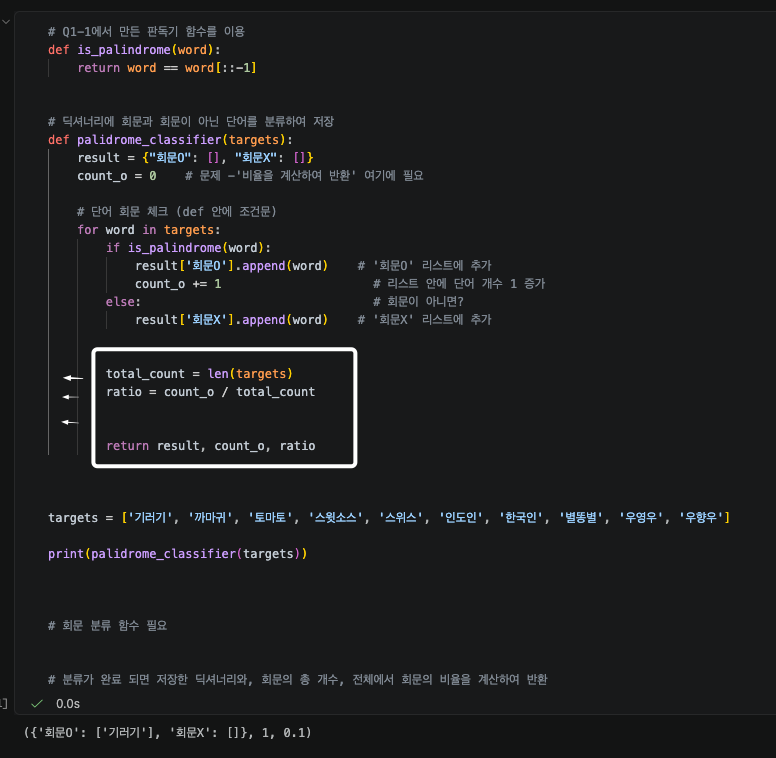

# AIFFEL Campus Online Code Peer Review Templete
- 코더 : 김수경
- 리뷰어 : 김민욱


# PRT(Peer Review Template)
- [X]  **1. 주어진 문제를 해결하는 완성된 코드가 제출되었나요?**
    - Q1-1(회문 판독기), Q2-1(성적 데이터화)은 의도대로 동작합니다. Q1-1은 두 target에 대해 `True`/`False`가 정확히 출력됩니다.
    - 다만 Q1-2(회문 분류기)는 버그로 첫 단어만 처리되고, Q2-2(성적 분석기)는 미완성 상태라 부분 제출로 보았습니다.  
    - 하지만 거의 완성된 코드로 인정하겠습니다.
    ```python
    # Q1-1: 정상 동작 확인
    def is_palindrome(word):
        return word == word[::-1]
    print(is_palindrome("아많다많다많다많아"))  # True
    print(is_palindrome("아정말많다많다많아"))  # False
    ```
    

- [X]  **2. 핵심 부분에 작성된 주석/doc string을 보고 코드가 잘 이해되었나요?**
    - Q1-1에서 `return`을 쓸 때와 안 쓸 때(`None` 반환)의 차이를 직접 주석으로 정리한 부분이 인상적이었습니다.   
      함수가 "계산만 하고 결과를 버린다"는 개념을 자기 말로 풀어 써서, 왜 이 줄이 핵심인지 명확했습니다.
    ```python
    def is_palindrome(word):
        return word == word[::-1]  # return 필수 : 결과값 받아서 다른계산에 써야할때
                                   # 생략하면 함수는 계산만 하고 그 결과는 버린 뒤,
                                   # None을 돌려준다.
    ```
    - `word[::-1]`이 "처음부터 끝까지 뒤집어 출력"이라는 슬라이싱 설명도 회문 조건식의 원리를 짚어줘서 이해가 잘 됐습니다.  
    


- [X]  **3. 에러를 디버깅한 기록 또는 새로운 시도가 있었나요?**
    - Q1-1을 두 셀로 나눠, `return` 없는 첫 버전이 `None`을 출력한 것을 확인한 뒤  
     `return`을 추가해 고치는 과정을 그대로 남긴 점이 좋았습니다.  
     결과(None → True/False)가 셀 출력에 같이 보여 디버깅 흐름이 명확합니다.  
     

- [ ]  **4. 회고를 잘 작성했나요?**
    - 저도 개인 회고를 작성해야 하는줄 몰랐는데 이런 리뷰 내용이 있네요. 그 짧은 시간 안에 개인 리뷰까지 하라니 매우 촉박하네요^^;; 서로 화이팅!

- [X]  **5. 코드가 간결하고 효율적인가요? (PEP8, 함수화)**
    - 문제별로 함수를 분리하고 Q1-1 함수를 Q1-2에서 재사용한 구조가 좋습니다.  
    


# 회고(참고 링크 및 코드 개선)

리뷰어 회고:
Q1-1의 return/None 디버깅 기록과 주석이 특히 좋았습니다. 같은 개념을 막 배운 입장에서  
"왜 None이 나오는가"를 본인 말로 정리해 둔 게 복습할 때도 도움이 될 것 같아요.  


- Q1-2: `return`이 for 루프 안에 들어가 첫 단어만 처리됩니다.  
현재 출력이 `({'회문O': ['기러기'], '회문X': []}, 1, 0.1)`로 나오는데,   
`total_count`/`ratio`/`return`이 `for` 루프 안쪽에 들여쓰기되어 있어서  
첫 번째 단어('기러기')를 처리하자마자 함수가 반환되기 때문입니다.  
세 줄을 함수 레벨(루프 바깥)로 한 단계 내어쓰면 모든 단어를 처리할 것입니다.  


