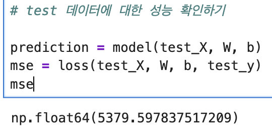
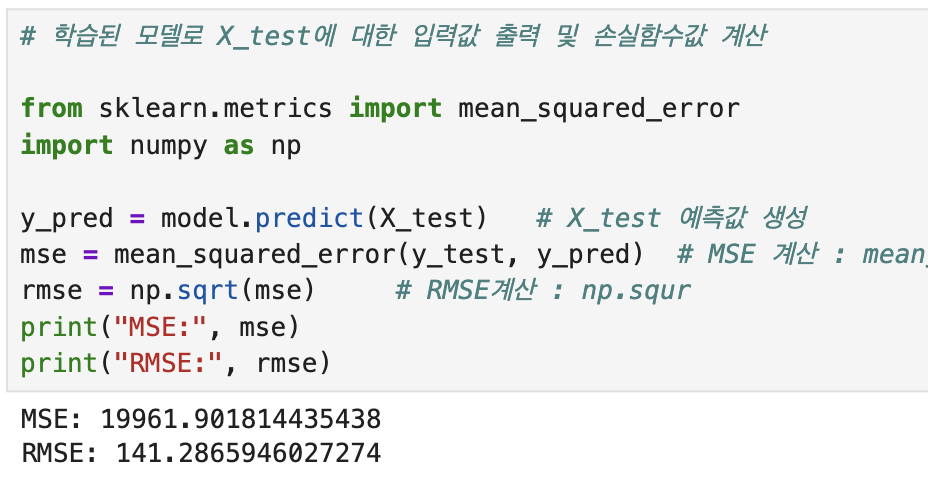
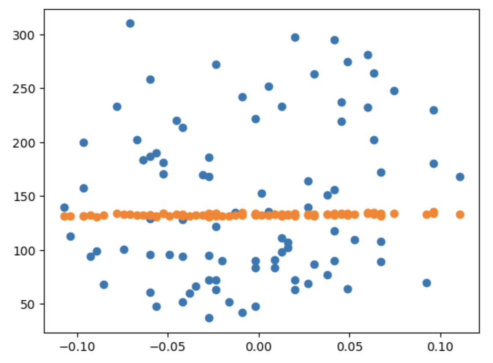
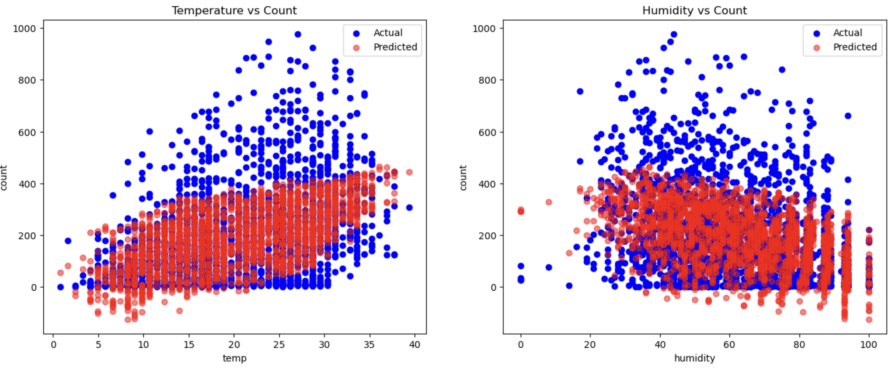
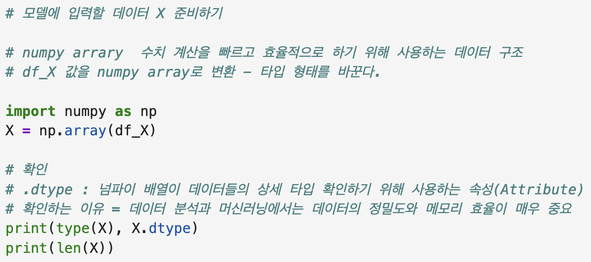
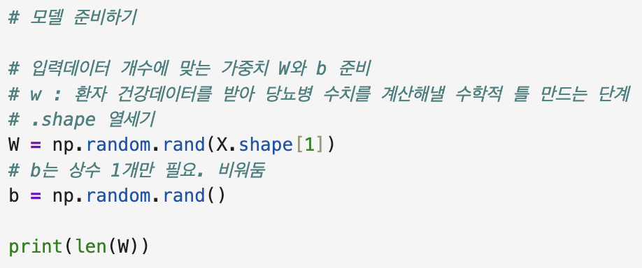
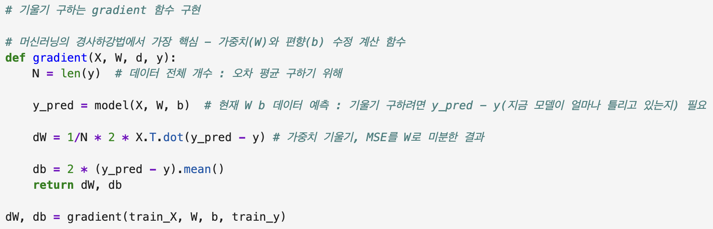
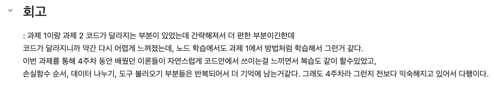
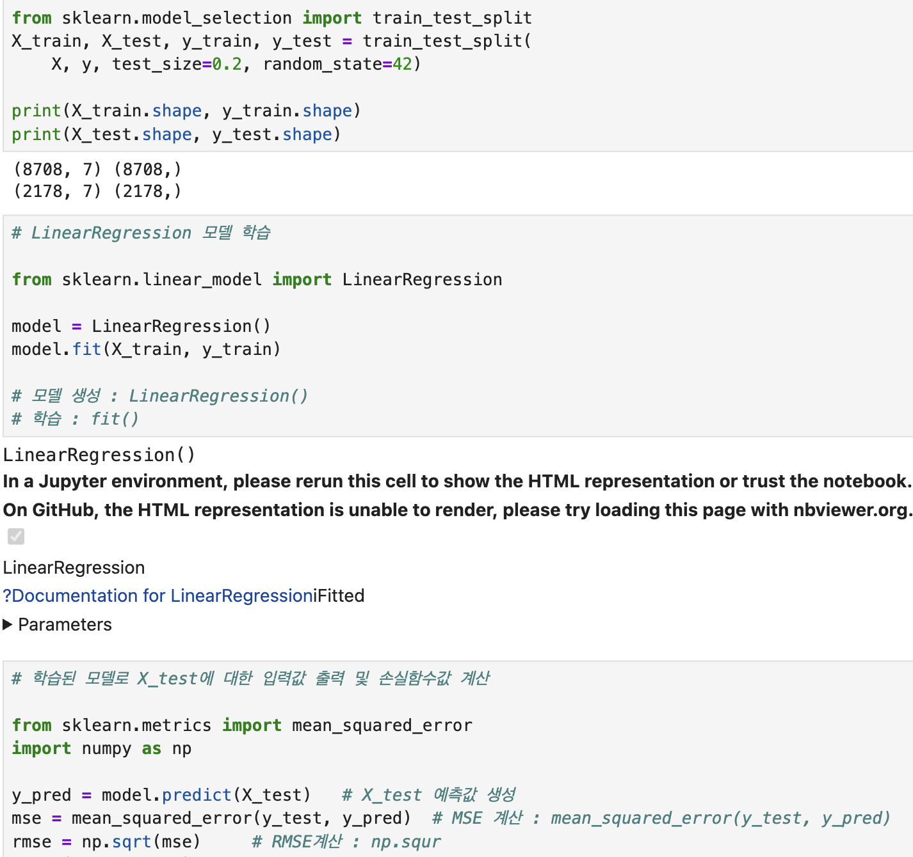

# AIFFEL Campus Online Code Peer Review Templete
- 코더 : 김수경
- 리뷰어 : 이다겸


# PRT(Peer Review Template)
- [ ]  **1. 주어진 문제를 해결하는 완성된 코드가 제출되었나요?**

     
[ 평가 기준 ]

프로젝트1 : MSE 손실함수값 3000 이하 달성   


- MSE 손실함수값이 5379.6으로 기준를 달성하지 못함  

프로젝트2: RMSE 값 150 이하를 달성  


- RMSE값이 141로 기준치 이하 달성 


공통 : 각 프로젝트 진행 과정에서 요구하고 있는 데이터개수 시각화 및 예측결과 시각화를 모두 진행   
  
  

- 1, 2번 프로젝트 데이터 개수의 시각화 및 예측결과 시각화 모두 완료 
 


    
- [x]  **2. 전체 코드에서 가장 핵심적이거나 가장 복잡하고 이해하기 어려운 부분에 작성된 
주석 또는 doc string을 보고 해당 코드가 잘 이해되었나요?**
  




```
코드의 작동 원리와 코드 사용의 근본적인 이유를 기술하였다.   
또한 모델을 구현하는데 있어 가장 중요한 경사하강법을 구현하기 위한 함수를 작성함에 있어,  
왜 이러한 형태로 함수가 작성되었는지에 대한 구체적인 주석을 남겼다.    
```  
  
- [ ]  **3. 에러가 난 부분을 디버깅하여 문제를 해결한 기록을 남겼거나
새로운 시도 또는 추가 실험을 수행해봤나요?**

디버깅 또는 추가 실험 수행 내역은 없다.   

       
- [x]  **4. 회고를 잘 작성했나요?**



퀘스트를 진행하면서 본인이 느낀 점과, 퀘스트 자체에 대한 회고가 작성되었다.   
        
- [x]  **5. 코드가 간결하고 효율적인가요?**



사이킷런 라이브러리를 이용하여 선형회귀모델의 적용을 간결하고 효율적으로 구현하였다.     
  

# 회고(참고 링크 및 코드 개선)
```
# 리뷰어의 회고를 작성합니다.
# 코드 리뷰 시 참고한 링크가 있다면 링크와 간략한 설명을 첨부합니다.
# 코드 리뷰를 통해 개선한 코드가 있다면 코드와 간략한 설명을 첨부합니다.
```

```text
코드를 구현할 때 습관적으로 회고를 작성해야 하는데, 아직 나는 이게 익숙해 지지 않아서 또 빼먹고 말았다. 
수경그루님은 주석도 꼼꼼하게 작성하고 회고로 마무리까지 깔끔했다. 
다만 프로젝트1의 평가기준을 맞추지 못한 부분이 약간 아쉬움으로 남는다. 
또한 노드에서 제안한 바와 같이, 당뇨병과 직접적인 관련성이 있는 것으로 보이는 feature를 골라서 추가적인 연습을 해 보는 것을 추천한다. 
```
