# AIFFEL Campus Online Code Peer Review Templete
- 코더 : 김수경
- 리뷰어 : 박애희


# PRT(Peer Review Template)
- [x]  **1. 주어진 문제를 해결하는 완성된 코드가 제출되었나요?**
    - 문제에서 요구하는 최종 결과물이 첨부되었는지 확인
        - 중요! 해당 조건을 만족하는 부분을 캡쳐해 근거로 첨부  
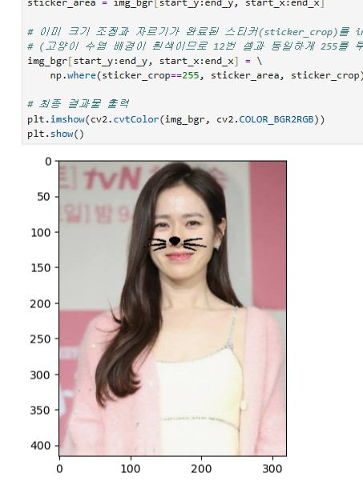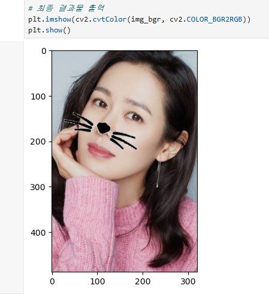
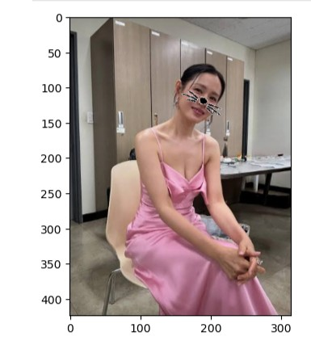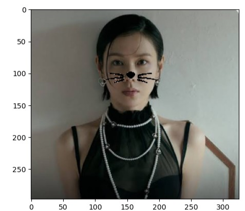
> 주어진 문제를 모두 해결하여 다양한 최종 결과물이 나왔다.

    
- [x]  **2. 전체 코드에서 가장 핵심적이거나 가장 복잡하고 이해하기 어려운 부분에 작성된 
주석 또는 doc string을 보고 해당 코드가 잘 이해되었나요?**
    - 해당 코드 블럭을 왜 핵심적이라고 생각하는지 확인
    - 해당 코드 블럭에 doc string/annotation이 달려 있는지 확인
    - 해당 코드의 기능, 존재 이유, 작동 원리 등을 기술했는지 확인
    - 주석을 보고 코드 이해가 잘 되었는지 확인
        - 중요! 잘 작성되었다고 생각되는 부분을 캡쳐해 근거로 첨부  
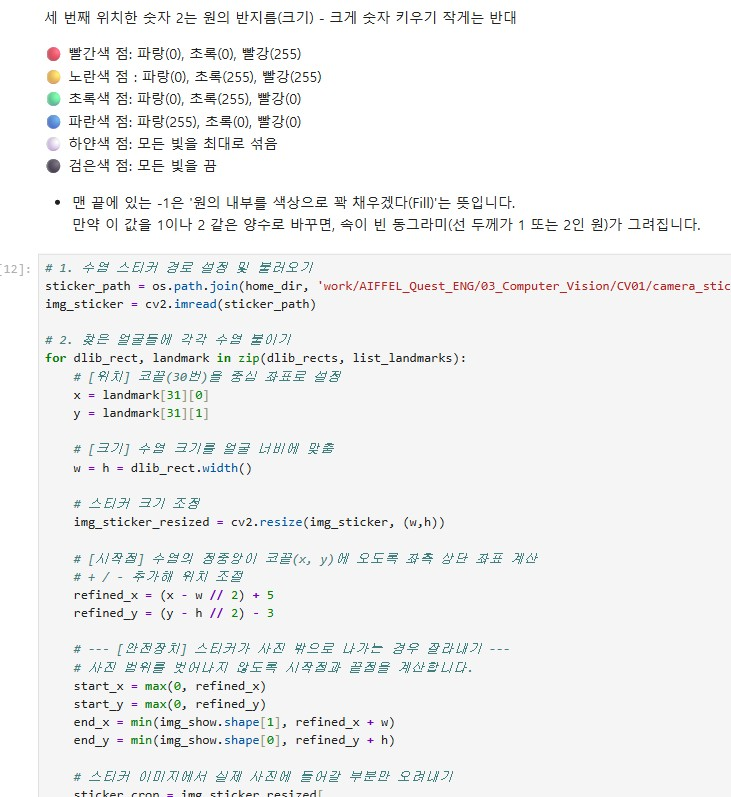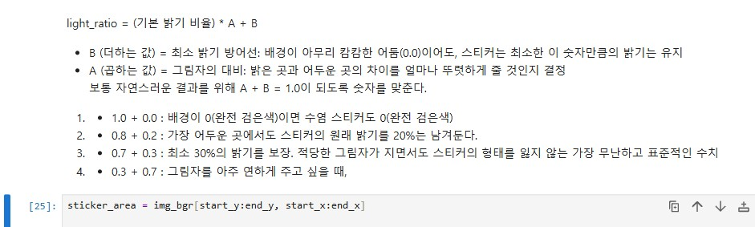
> 중요하게 생각해봐야 되는 부분, 작동 원리나 기능 등 자세하게 기록되어 있다.

        
- [x]  **3. 에러가 난 부분을 디버깅하여 문제를 해결한 기록을 남겼거나
새로운 시도 또는 추가 실험을 수행해봤나요?**
    - 문제 원인 및 해결 과정을 잘 기록하였는지 확인
    - 프로젝트 평가 기준에 더해 추가적으로 수행한 나만의 시도, 
    실험이 기록되어 있는지 확인
        - 중요! 잘 작성되었다고 생각되는 부분을 캡쳐해 근거로 첨부  
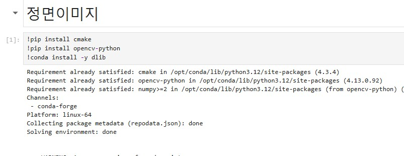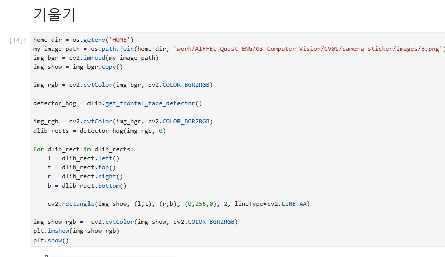
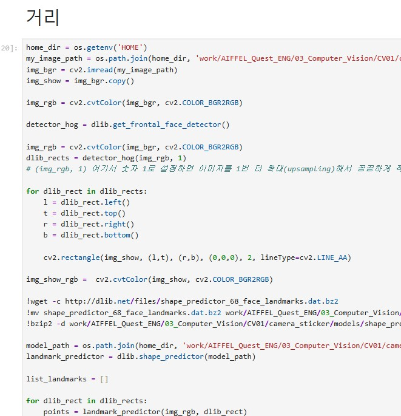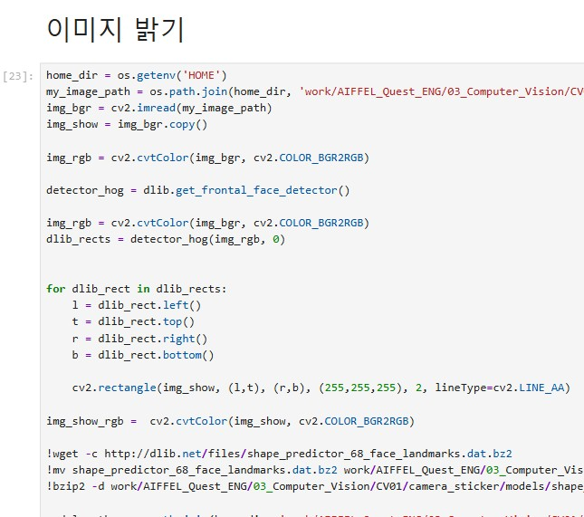
> 다양한 상황을 시도하고 해결한 과정이 모두 상세히 기록되어 있어서 공부가 된다. 

        
- [x]  **4. 회고를 잘 작성했나요?**
    - 주어진 문제를 해결하는 완성된 코드 내지 프로젝트 결과물에 대해
    배운점과 아쉬운점, 느낀점 등이 기록되어 있는지 확인
    - 전체 코드 실행 플로우를 그래프로 그려서 이해를 돕고 있는지 확인
        - 중요! 잘 작성되었다고 생각되는 부분을 캡쳐해 근거로 첨부  
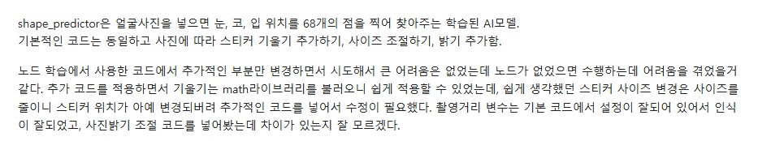

> 과정과 시도하셨던 부분에 대해 기록되어 있다.

        
- [x]  **5. 코드가 간결하고 효율적인가요?**
    - 파이썬 스타일 가이드 (PEP8) 를 준수하였는지 확인
    - 코드 중복을 최소화하고 범용적으로 사용할 수 있도록 함수화/모듈화했는지 확인
        - 중요! 잘 작성되었다고 생각되는 부분을 캡쳐해 근거로 첨부  
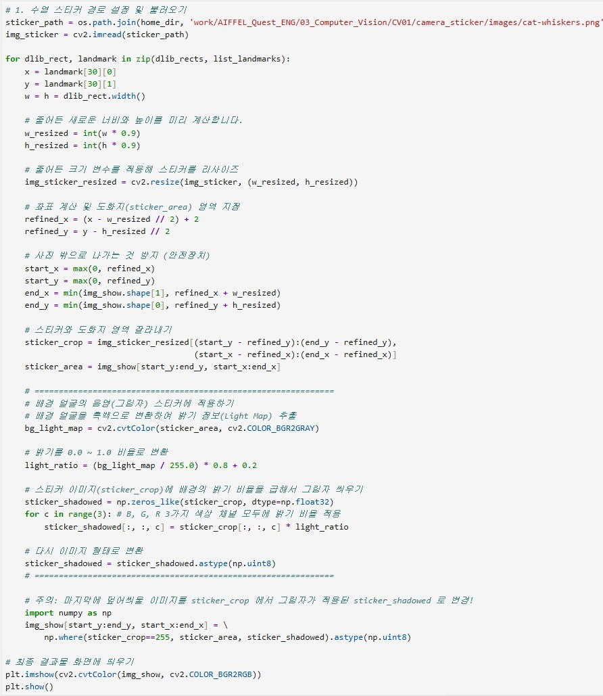

> 필요한 코드들만 다양하게 활용하여 진행하신 것 같다.


# 회고(참고 링크 및 코드 개선)
```
# 리뷰어의 회고를 작성합니다.
# 코드 리뷰 시 참고한 링크가 있다면 링크와 간략한 설명을 첨부합니다.
# 코드 리뷰를 통해 개선한 코드가 있다면 코드와 간략한 설명을 첨부합니다.
```  
  
> 나는 1가지 최상의 사진만 가져와 테스트를 했는데 수경님은 정면, 기울기, 거리, 밝기 4가지 다양한 경우를 모두 진행해 보고 자세히 기록도 하셔서 너무 대단하시고, 중요하거나 생각해봐야 하는 부분에 대한 기록도 자세히 되어 있어서 보는데 도움이 됐다. 다 이해하고 소화하신 것 같아서 다음 프로젝트도 걱정이 없으실 것 같고 나도 많은 공부가 될 것 같다.

